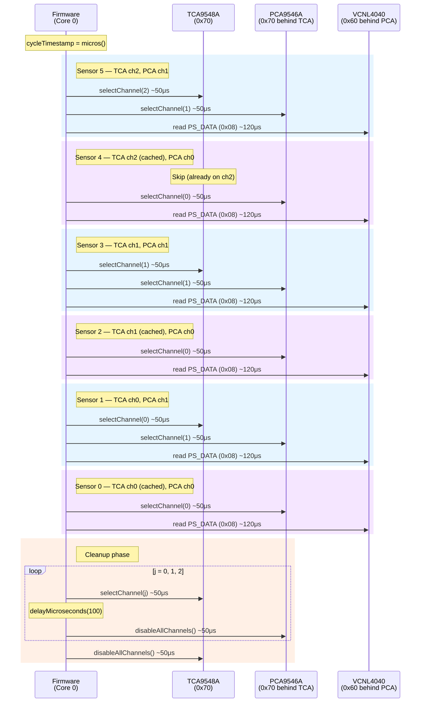

# Sensor Reading Pipeline — Timing Analysis

How sensor data flows from the VCNL4040 hardware through the I2C mux chain to the firmware buffer, and where each microsecond goes.

---

## Hardware Topology

```
ESP32-S3 (I2C @ 400 kHz, SDA=43, SCL=44)
  └─ TCA9548A (8-ch mux, addr 0x70)
       ├─ Ch 0 → PCA9546A #1 (4-ch mux, addr 0x70)
       │    ├─ Ch 0 → VCNL4040 Sensor 0 (P1S1)
       │    └─ Ch 1 → VCNL4040 Sensor 1 (P1S2)
       ├─ Ch 1 → PCA9546A #2
       │    ├─ Ch 0 → VCNL4040 Sensor 2 (P2S1)
       │    └─ Ch 1 → VCNL4040 Sensor 3 (P2S2)
       └─ Ch 2 → PCA9546A #3
            ├─ Ch 0 → VCNL4040 Sensor 4 (P3S1)
            └─ Ch 1 → VCNL4040 Sensor 5 (P3S2)
```

Each sensor module has two VCNL4040 sensors (Side A and Side B) behind a PCA9546A sub-mux. Three modules connect to the TCA9548A on channels 0-2.

---

## Two Independent Clocks

There are two clocks running independently:

### 1. Sensor Measurement Clock (internal to each VCNL4040)

Each sensor autonomously produces new proximity measurements at a rate determined by its configuration:

```
Measurement Rate ≈ 1,000,000 / (IT_μs × duty_denominator)
```

Where `T = 125 μs` (one integration time unit, verified by oscilloscope in the Vishay design guide).

| IT | Pulse Width | Period @ 1/40 | Rate @ 1/40 |
|----|------------|--------------|-------------|
| 1T | 125 μs | ~5.0 ms | **~200 Hz** |
| 1.5T | 187.5 μs | ~7.5 ms | **~133 Hz** |
| 2T | 250 μs | ~10.0 ms | **~100 Hz** |
| 2.5T | 312.5 μs | ~12.5 ms | **~80 Hz** |
| 3T | 375 μs | ~15.0 ms | **~67 Hz** |
| 3.5T | 437.5 μs | ~17.5 ms | **~57 Hz** |
| 4T | 500 μs | ~20.0 ms | **~50 Hz** |
| 8T | 1000 μs | ~40.0 ms | **~25 Hz** |

> **Formula confidence: Medium.** This formula is not explicitly stated in Vishay documentation. It is derived from design guide proportionality statements and timing data (e.g., 1T/1/40 measured at 4.85 ms vs our calculated 5.0 ms — ~3% error). See `CONFIGURATION_GUIDE.md` for full source analysis.

**Multi-pulse (PS_MPS) is believed to NOT affect measurement rate.** Multi-pulse fires 2/4/8 IR pulses within the same measurement window, boosting signal strength without extending the period. This claim is supported by the Linux kernel IIO driver (which treats PS_MPS independently as "oversampling_ratio") but is not directly confirmed by Vishay documentation. See `CONFIGURATION_GUIDE.md` for full source analysis.

### 2. Firmware Polling Clock (I2C read cycle on Core 0)

The sensor task (`SensorManager::sensorTaskFunction`) runs on Core 0 and sequentially reads all 6 sensors through the mux chain. The target interval is `SAMPLE_INTERVAL_US = 1000 μs` (1 kHz), but the actual cycle takes longer, so the firmware runs as fast as the I2C bus allows.

---

## Sequence Diagram — One Complete Read Cycle



---

## Timing Breakdown

### I2C Transaction Costs (400 kHz)

| Operation | I2C Bytes | Estimated Time |
|-----------|----------|----------------|
| TCA9548A select channel | START + addr + 1 data + STOP | ~50 μs |
| PCA9546A select channel | START + addr + 1 data + STOP | ~50 μs |
| Read PS_DATA (2 bytes) | write(addr+reg) + read(2 bytes) | ~120 μs |
| Read ALS_DATA (2 bytes) | write(addr+reg) + read(2 bytes) | ~120 μs |

### Per-Cycle Totals

| Phase | Count | Unit Cost | Subtotal |
|-------|-------|-----------|----------|
| TCA mux switches | 3 | ~50 μs | ~150 μs |
| PCA mux switches | 6 | ~50 μs | ~300 μs |
| Proximity reads | 6 | ~120 μs | ~720 μs |
| **Sensor reads subtotal** | | | **~1,170 μs** |
| Cleanup: TCA selects | 3 | ~50 μs | ~150 μs |
| Cleanup: delays | 3 | 100 μs | **~300 μs** |
| Cleanup: PCA disables | 3 | ~50 μs | ~150 μs |
| Cleanup: TCA disable | 1 | ~50 μs | ~50 μs |
| **Cleanup subtotal** | | | **~650 μs** |
| **Total (prox only)** | | | **~1,820 μs** |
| *+ ALS reads (if enabled)* | 6 | ~120 μs | *+720 μs* |
| **Total (prox + ALS)** | | | **~2,540 μs** |

### Effective Polling Rates

| Mode | Cycle Time | Polls/sec per sensor |
|------|-----------|---------------------|
| Proximity only | ~1.82 ms | **~549 Hz** |
| Proximity + ALS | ~2.54 ms | **~394 Hz** |

### Oversampling Ratio

The firmware polls faster than the sensor can produce new data at all practical settings:

| Sensor Setting | Sensor Rate | Poll Rate | Oversampling Ratio |
|---------------|------------|-----------|-------------------|
| 1T / 1/40 | ~200 Hz | ~549 Hz | ~2.7× |
| 2T / 1/40 | ~100 Hz | ~549 Hz | ~5.5× |
| 2.5T / 1/40 | ~80 Hz | ~549 Hz | ~6.9× |
| 4T / 1/40 | ~50 Hz | ~549 Hz | ~11× |
| 8T / 1/40 | ~25 Hz | ~549 Hz | ~22× |

**The sensor measurement rate is always the bottleneck, not the I2C pipeline.** Stale reads (same value across consecutive polls) are expected and normal.

---

## Cleanup Phase: Why It Exists

After each read cycle, the firmware disables all mux channels:

```cpp
for (int j = 0; j < 3; j++) {
    mux.selectChannel(j);
    delayMicroseconds(100);      // Bus stabilization
    pca_instances[j].disableAllChannels();
}
mux.disableAllChannels();
```

This prevents I2C bus contention if other tasks attempt to use the bus between cycles. The 3 × 100 μs delays add 300 μs (~16% of cycle time) but do not affect throughput since we are already oversampling.

---

## What the Dashboard Shows

The Serial Studio dashboard displays two rate metrics:

- **Sensor Rate (Hz):** Calculated from `1,000,000 / (IT_μs × duty_denominator)`. This is the approximate rate at which each sensor produces genuinely new measurements. Derived from settings (see formula confidence note above).

- **Poll Rate (Hz):** Measured count of complete read cycles per second. This is how fast the firmware is reading the sensors through I2C. Should always exceed Sensor Rate.

If Poll Rate ever drops below Sensor Rate, the I2C pipeline has become the bottleneck (unlikely with current hardware and settings).

---

## Key Files

| File | Role |
|------|------|
| `firmware/src/components/sensor/SensorManager.cpp` | Sensor task, read loop, mux switching |
| `firmware/src/components/sensor/SensorManager.h` | Sensor mapping, PCA9546A class, constants |
| `firmware/src/components/tca9548a/TCA9548A.cpp` | TCA9548A channel selection with caching |
| `firmware/src/components/serialstudio/SerialStudioOutput.cpp` | Rate calculation and telemetry emission |
| `docs/references/vcnl4040/CONFIGURATION_GUIDE.md` | VCNL4040 settings and their effects |
| `docs/references/vcnl4040/designingvcnl4040.txt` | Vishay design guide (source of T = 125 μs) |

---

## Integration Time Discrepancy Note

The Vishay design guide contains two different values for 1T in different sections:

- **"about 100 μs" (line 356)** — used in an overview/approximation context
- **"125 μs" (lines 438, 461, 537)** — from oscilloscope measurements and detailed calculations

The 125 μs value is used in all firmware calculations as it comes from direct measurement. The "100 μs" figure appears to be a rounded approximation for marketing/overview text.

---

*Last Updated: February 2026*
